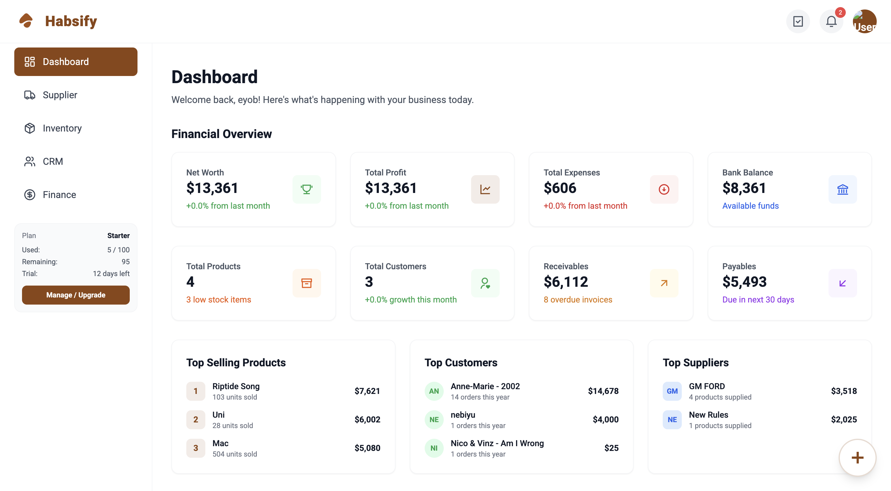

<div align="center">

# 📦 Habsify SaaS

[](#)
[](#)
[](#)
[](#)

*A multi-tenant, subscription-based business management platform providing CRM, inventory, finance, sales, and analytics modules for SMEs in Ethiopia and Africa.*

[Features](#-features) • [Screenshots](#-screenshots) • [Tech Stack](#-tech-stack) • [Quick Start](#-quick-start)

</div>

---

## ⚡ Overview

**Habsify SaaS** is a comprehensive multi-tenant, subscription-based business management platform built with a robust **Django REST Framework** backend and a blazing-fast **React** and **TypeScript** frontend. Designed specifically for small and medium enterprises in Ethiopia and Africa, it delivers an intuitive experience for handling everything from multi-warehouse inventory tracking to complex CRM, sales, and financial workflows. Complete with role-based access, tiered subscription plans, and deep analytics, Habsify empowers businesses to scale without the headache.

---

## 🚀 Key Features

- 📦 **Smart Inventory Tracking** – Monitor stock movements across multiple warehouses, manage SKUs, categories, and reorder levels effortlessly.
- 👥 **CRM & Supplier Hub** – Centralized management for customers and vendors, tracking individual interactions and invoices.
- 💵 **Finance & Transactions** – Keep tabs on business health, cash flow, multiple bank accounts, and custom transaction types.
- 🛡️ **Secure Authentication** – JWT-based sessions, granular role management, and bulletproof endpoints provided by Django Djoser.
- 💎 **Flexible Subscriptions** – Out-of-the-box tiered SaaS plans and 14-day free trial limits, perfect for B2B deployments.
- ⚡ **Real-Time Dashboards** – Interactive visualizations, predictive data fetching via React Query, and buttery-smooth Framer Motion transitions.

---

## 📸 Sneak Peek

<div align="center">

| Dashboard | Inventory Hub | Transaction Logs |
|:---:|:---:|:---:|
|  |  |  |


</div>

---

## 🛠️ The Tech Stack

### Client-Side (Frontend)
- **Framework:** React + React Router
- **State Management:** TanStack React Query
- **Styling:** Tailwind CSS + Framer Motion
- **Forms & Validation:** React Hook Form + Zod

### Server-Side (Backend)
- **Core:** Python & Django
- **API:** Django REST Framework (DRF)
- **Auth:** Djoser (JWT)
- **Database:** PostgreSQL

### DevOps
- Docker & Docker Compose
- Heroku / Render Ready

---

## 🐳 Quick Start: Docker (Recommended)

Get Habsify up and running in minutes without local dependencies!

1. **Clone the repository:**
   ```bash
   git clone https://github.com/eyobcode/habsify.git
   cd habsify
   ```

2. **Spin up the environment:**
   ```bash
   docker-compose up --build -d
   ```
   *This single command builds and starts the backend, frontend, and database containers.*

3. **Access the Application:**
   - Frontend: `http://localhost:5173`
   - Backend API: `http://localhost:8000`

---

## 💻 Manual Developer Setup

Prefer to run things locally? No problem!

<details>
<summary><b>1. Backend (Django) Setup</b></summary>

```bash
cd backend
python -m venv venv
source venv/bin/activate  # Windows: venv\Scripts\activate
pip install -r requirements.txt
python manage.py migrate
python manage.py runserver
```

</details>

<details>
<summary><b>2. Frontend (React) Setup</b></summary>

```bash
cd habsify-react
npm install
npm run dev
```

</details>

---

## 📄 License

This project is licensed under the standard **MIT License**.

<div align="center">
  <i>Built with ❤️ by Eyob Mulugeta</i>
</div>
